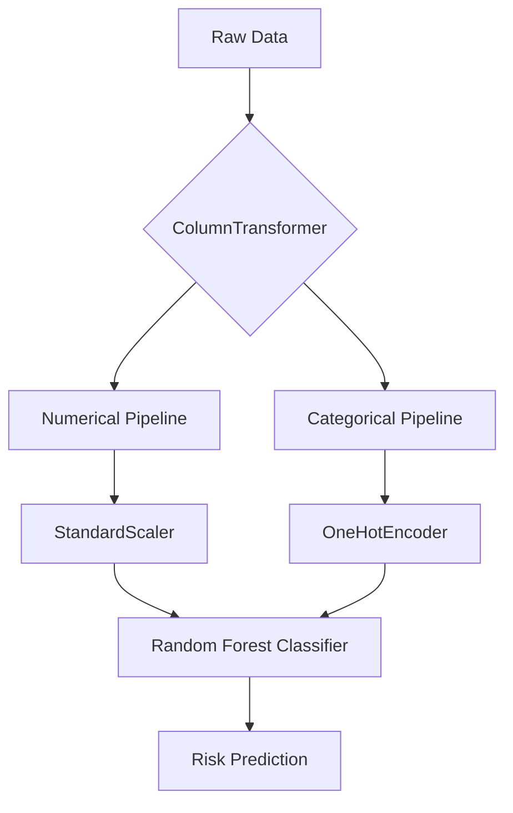
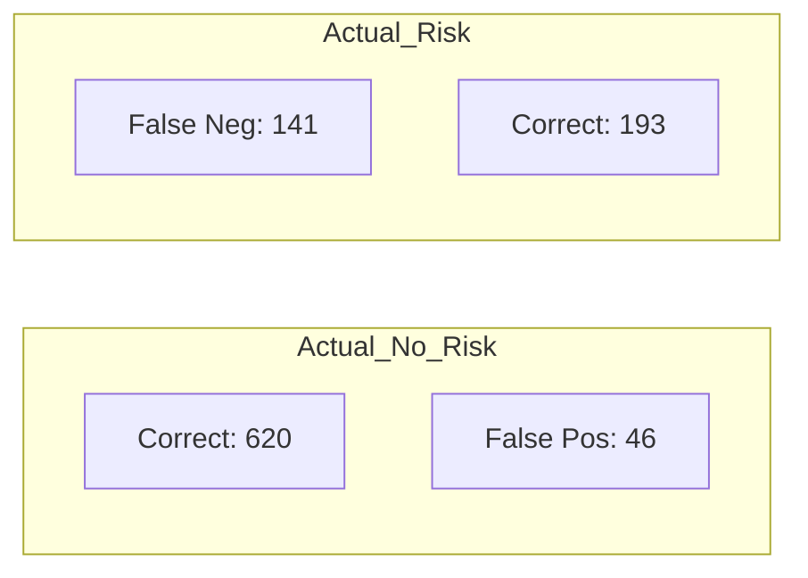
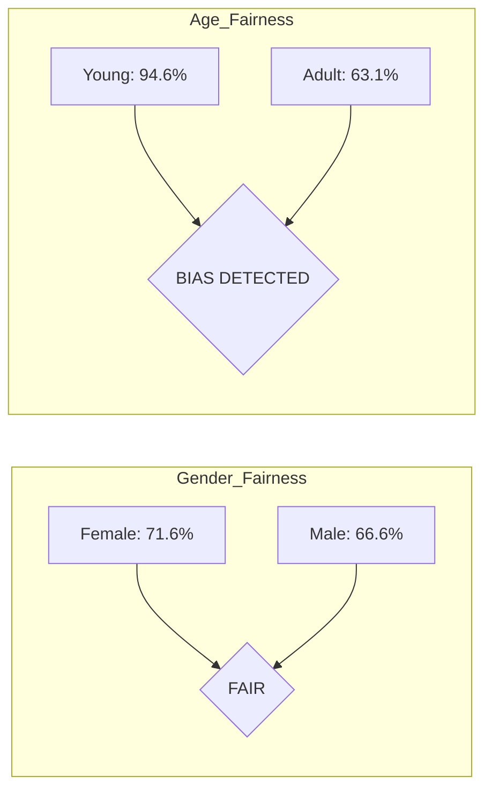
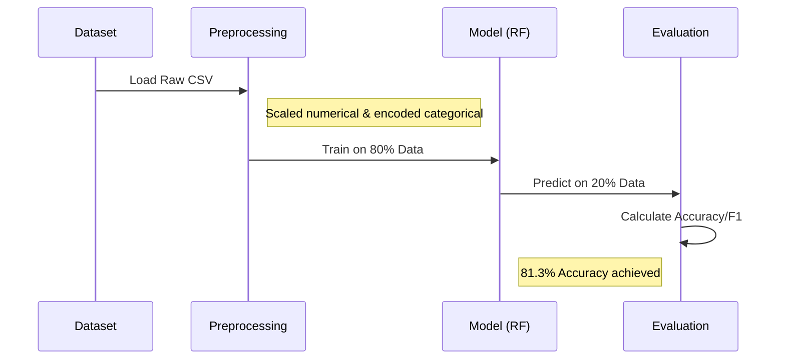

# Loan Approval Prediction - Model Quality Report

This document provides a comprehensive overview of the loan approval prediction model, its architecture, and performance metrics.

## Model Overview
The model is designed to classify loan applicants into "Risk" or "No Risk" categories based on financial and demographic data from the German Credit Risk dataset.

### Pipeline Architecture
The model uses a scikit-learn Pipeline that handles both preprocessing and classification in a single object.

## Performance Metrics

The model achieved an overall accuracy of **81.3%** on the hold-out test set (20% of the total data).

### Classification Report
| | Precision | Recall | F1-Score | Support |
|---|---|---|---|---|
| **No Risk** | 0.81 | 0.93 | 0.87 | 666 |
| **Risk** | 0.81 | 0.58 | 0.67 | 334 |
| **Accuracy** | | | **0.81** | 1000 |
| **Macro Avg** | 0.81 | 0.75 | 0.77 | 1000 |
| **Weighted Avg** | 0.81 | 0.81 | 0.80 | 1000 |

### Confusion Matrix
The confusion matrix shows the distribution of correct and incorrect predictions:

| | Predicted No Risk | Predicted Risk |
|---|---|---|
| **Actual No Risk** | 620 | 46 |
| **Actual Risk** | 141 | 193 |

## Fairness Analysis
A fairness audit was conducted to investigate potential bias against protected groups (Gender and Age).

### Gender Fairness (Sex)
The model shows no significant bias against female applicants. In fact, female applicants have a slightly higher approval rate, which aligns with the training data.

- **Female Approval Rate**: 71.57%
- **Male Approval Rate**: 66.62%
- **Disparate Impact Ratio**: 0.93 (Passes 80% rule)

### Age Fairness
A significant disparity was detected between Age groups. Unexpectedly, young applicants (<25) have a much higher predicted approval rate than adults.

- **Young (<25) Approval Rate**: 94.55%
- **Adult (>=25) Approval Rate**: 63.07%
- **Disparate Impact Ratio**: 0.67 (**Fails 80% rule**)

> [!IMPORTANT]
> The bias against adults is inherent in the dataset. In the original data, 93.5% of applicants under 25 are labeled as "No Risk", compared to only 61.0% of adults. The model has learned this pattern accurately.

## Data Process Workflow
## Data Process Workflow
The following diagram illustrates the end-to-end data processing and modeling workflow:

## How to Reproduce
1.  **Exploration**: Run `eda_loan.py` to see data distributions.
2.  **Training**: Run `train_loan.py` to preprocess, train, and save the model.
3.  **Fairness**: Run `fairness_analysis.py` to see bias metrics.
4.  **Prediction**: Use `predict_loan.py` to run predictions on specific samples.

## Files Description
- `German credit risk data set.csv`: Original dataset.
- `eda_loan.py`: Exploratory Data Analysis script.
- `train_loan.py`: Main training and preprocessing pipeline.
- `fairness_analysis.py`: Fairness auditing script.
- `predict_loan.py`: Script for demonstrating model usage.
- `loan_approval_model.joblib`: Persisted model file.
