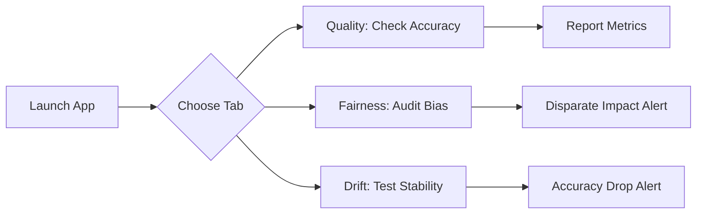

# Streamlit Monitoring Dashboard Demo

This interactive dashboard allows you to explore the Loan Approval Model's performance across three key areas: Quality, Fairness, and Drift.

## 1. Environment Setup (Portability)
Before running the dashboard, create and activate a virtual environment:

```bash
# Run the setup script to create 'penv' and install dependencies
bash setup_env.sh

# Activate the environment
source penv/bin/activate
```

## 2. How to Launch
Once the environment is active, launch the dashboard:

### 📊 Model Quality Tab
- View overall accuracy metrics.
- Explore the **Classification Report** (Precision, Recall, F1).
- Analyze the **Confusion Matrix** to see true/false positives and negatives.

### ⚖️ Fairness Analysis Tab
- **Gender Bias**: View approval rates for male vs. female applicants.
- **Age Bias**: Explore the disparity in approval rates for young applicants (<25).
- **Rule of Thumb**: The dashboard automatically highlights if the **80% rule** for disparate impact is violated.

### 📉 Drift Analysis Tab
- **Degradation**: Compare performance on original data vs. a simulated "economic downturn" (drifted data).
- **Silent Failure**: See how the model maintains a constant approval rate despite a spike in actual risk levels.

### 🔮 Interactive Prediction Tab
- **Simplified Testing**: Focuses on key features like `LoanAmount`, `CreditHistory`, and `SavingsAccount` for faster testing.
- **Rejection Examples**: Includes one-click buttons to load sample "High Risk" scenarios (e.g., High Debt & Poor History) to demonstrate model triggers.
- **Immediate Feedback**: Provides clear "Success" vs. "Alert" messages after prediction.

## 3. Demo Workflow



## 4. Requirements
- Python 3.8+
- Streamlit
- Pandas
- Scikit-learn
- Seaborn/Matplotlib
- Joblib
