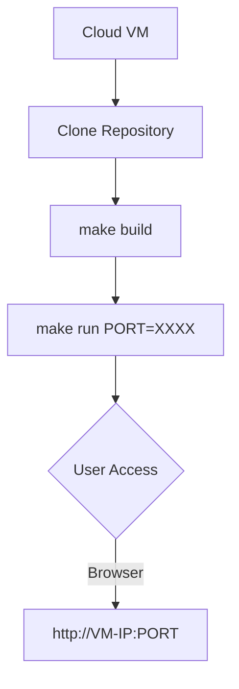

# Cloud Deployment Guide (Docker)

This guide explains how to deploy the Loan Approval Monitoring Dashboard to a Cloud VM using Docker and the provided Makefile.

## 1. Prerequisites
- Docker installed on the target VM.
- Access to the project files.

## 2. Quick Start with Makefile
The project includes a `Makefile` to simplify deployment and allow port customization.

### Build the Image
```bash
make build
```

### Run the Dashboard
By default, the app runs on port **8501**:
```bash
make run
```

### Change the UI Port
If port 8501 is occupied or you need a custom port for your Cloud VM, specify it via the `PORT` variable:
```bash
# Example: Run on port 9090
make run PORT=9090
```

## 3. Deployment Flow



## 4. Troubleshooting
- **Port Conflict**: If the app fails to start, ensure the port you selected is open in your Cloud VM's security group/firewall.
- **Image Size**: We use `python:3.9-slim` to keep the image size minimal (~400MB).
- **Stopping the App**: Run `make stop` to kill the container.
