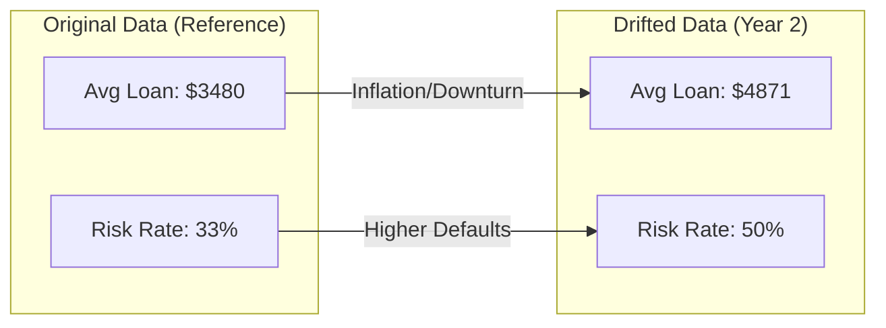
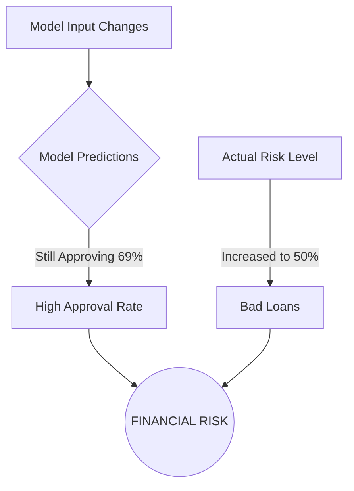

# Model Drift Analysis - Loan Approval Prediction

This report documents the impact of **Data Drift** and **Concept Drift** on the loan approval model's reliability.

## 1. Overview
Model drift occurs when the statistical properties of the target variable or the input data change over time, leading to performance degradation. We simulated a "Year 2" scenario involving an economic downturn.

## 2. Drift Simulation
The following changes were applied to create the synthetic `German_credit_drifted.csv`:
- **Feature Drift**: 
    - `LoanAmount` increased by 40%.
    - `LoanDuration` increased by 30%.
- **Concept Drift**: 
    - 25% of existing "No Risk" loans were reclassified as "Risk" to simulate higher default rates in a struggling economy.

## 3. Performance Impact
The model showed significant degradation when exposed to drifted data.

| Metric | Original Data | Drifted Data | Change |
|---|---|---|---|
| **Accuracy** | 96.26% | 77.46% | **-18.80%** |
| **Approval Rate** | 68.50% | 69.18% | +0.68% |

> [!WARNING]
> **Silently Failing Model**: While the actual risk in the data increased (from 33% to 50%), the model's approval rate remained almost identical (~69%). This indicates that the model is failing to detect the increased risk and is "blind" to the economic shift.

## 4. Indicators of Drift
- **Accuracy Drop**: A nearly 19% drop indicates a major shift in underlying patterns.
- **Precision/Recall Disparity**: 
    - **No Risk Recall (0.97)**: The model is extremely aggressive in approving loans.
    - **Risk Recall (0.58)**: The model only detects about 58% of actual risky loans in the new environment.

## 5. Monitoring Recommendations
To detect and mitigate this in production:
1.  **Monitor Feature Statistics**: Track means of `LoanAmount` and `LoanDuration`.
2.  **Monitor Prediction Distribution**: If the approval rate stays the same while macroeconomic indicators drop, trigger an alert.
3.  **Retraining Trigger**: Re-train the model as soon as newly labeled ground-truth data becomes available from the "Year 2" samples.
