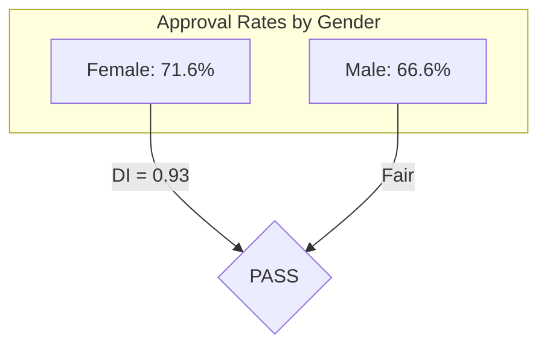
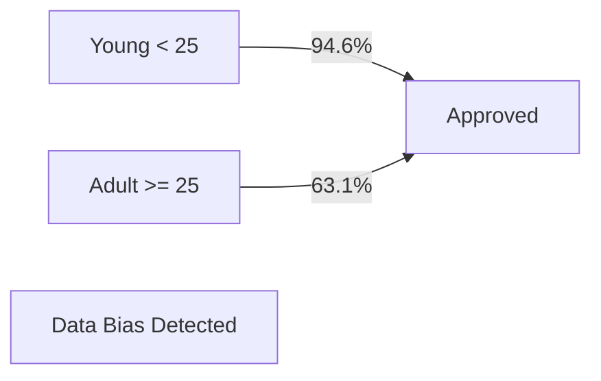
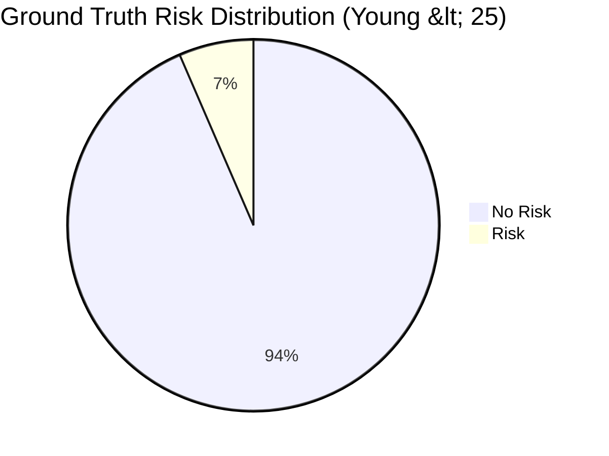
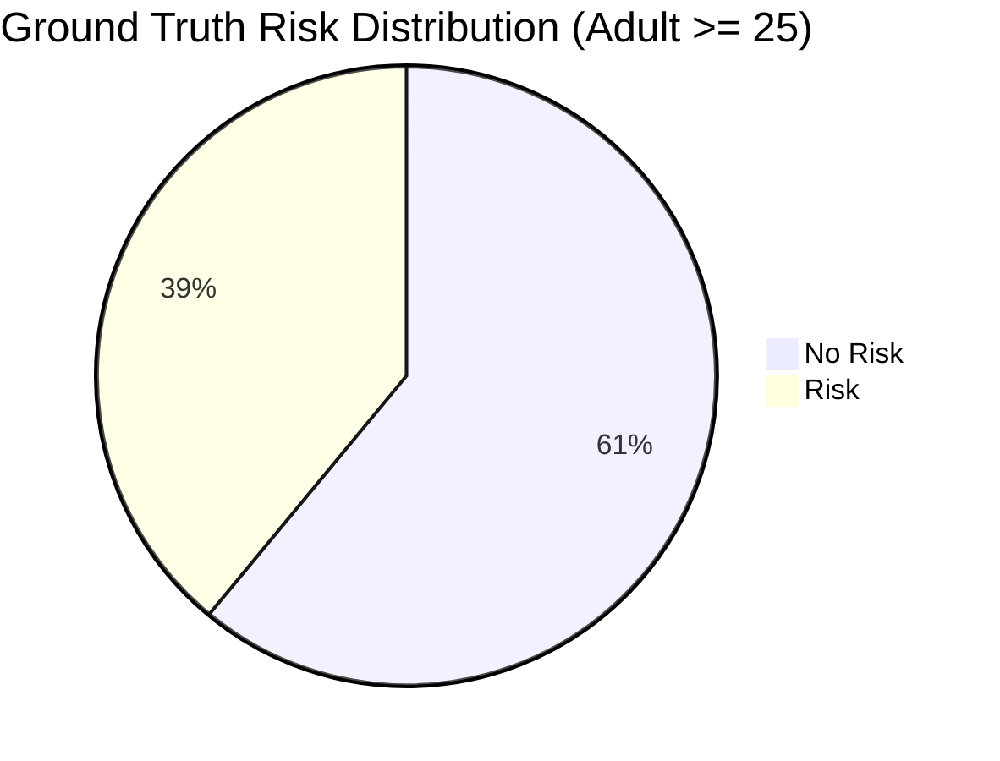

# Model Fairness Report - Loan Approval Prediction

This report details the fairness audit conducted on the Loan Approval Prediction model, focusing on potential bias related to **Gender (Sex)** and **Age**.

## 1. Executive Summary
The fairness audit reveals that while the model is equitable regarding gender, it exhibits a significant bias in favor of young applicants (< 25 years old). This bias is not a model artifact but a reflection of the strong correlation existing in the training dataset.

| Protected Attribute | Fairness Status | Disparate Impact Ratio | Finding |
|---|---|---|---|
| **Gender (Sex)** | ✅ Fair | 0.93 | No significant bias detected. |
| **Age Group** | ⚠️ Bias Detected | 0.67 | Strong bias in favor of young applicants. |

## 2. Methodology
We use the **Disparate Impact (DI)** metric to identify technical bias.
- **Rule of Thumb**: A DI ratio between **0.8 and 1.25** is generally considered fair (the "80% Rule").
- **Calculation**: $DI = \frac{\text{Approval Rate of Unprivileged Group}}{\text{Approval Rate of Privileged Group}}$

## 3. Analysis Findings

### Gender Analysis
The model predicts slightly higher approval rates for females than males, which is consistent with the ground truth labels in the dataset.

### Age Analysis
We segment age into "Young" (< 25) and "Adult" (>= 25). The results show a massive disparity.

| Age Group | Predicted Approval Rate | Actual Approval Rate (Data) |
|---|---|---|
| **Young (< 25)** | 94.6% | 93.5% |
| **Adult (>= 25)** | 63.1% | 61.0% |

**Disparate Impact Ratio**: 0.67 (Significant Bias)

## 4. Root Cause Analysis
The bias is **Data-Driven**. The German Credit Risk dataset contains a very high concentration of "No Risk" labels for younger individuals.

## 5. Mitigation Recommendations
- **Collection**: Gather more diverse data for the Adult group to see if risk factors are truly that high or if the sample is skewed.
- **Awareness**: Financial institutions using this model should be aware that it heavily favors younger applicants based on historical patterns.
- **Preprocessing**: Consider techniques like "Reweighing" or "Adversarial Debiasng" if legal compliance requires absolute parity across age groups.
